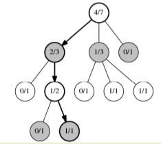
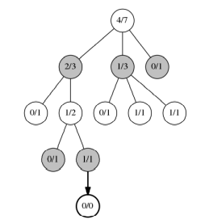
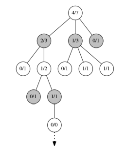
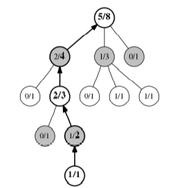

# mctsChessZero: Reinforcement Learning in AlphaZero

## 1 Introduction 
La semaine dernière, nous avons abordé une vue d'ensemble de l'apprentissage par renforcement. Cette conférence se concentre sur AlphaZero de DeepMind, l'un des développements les plus récents dans le domaine de l'apprentissage par renforcement.

##  2 Contexte 
En 2016, AlphaGo a battu Lee Sedol 4-1 dans une partie de Go, devenant le premier programme informatique à battre un champion du monde humain de Go. Le jeu de Go se joue sur un plateau 19x19 et possède un espace de recherche 10^100 fois plus grand que celui des échecs, ce qui le rend beaucoup plus difficile pour les ordinateurs. DeepMind a surmonté ce défi avec AlphaGo en entraînant un réseau de neurones profond sur des parties humaines expertes pour développer une fonction de politique et de valeur, puis en s'appuyant sur la recherche d'arbre Monte Carlo par renforcement pour améliorer les deux fonctions. Plus tard cette année-là, DeepMind a publié des détails sur le successeur d'AlphaGo, AlphaGo Zero, qui a battu AlphaGo 100-0. La partie "Zero" du nom fait référence au fait que le réseau neuronal d'AlphaGo Zero a été entièrement entraîné par auto-jeu, éliminant ainsi la première étape du processus d'apprentissage d'AlphaGo. DeepMind généraliserait plus tard son algorithme pour apprendre n'importe quel jeu à partir de zéro, à condition de fournir les règles du jeu et suffisamment de temps d'entraînement, et le baptiserait AlphaZero.

##  3 Recherche d'arbre Monte Carlo 
Une recherche d'arbre Monte Carlo (MCTS) est très similaire à l'algorithme Minimax. Les deux sont appliqués aux jeux déterministes, à somme nulle et à information parfaite, et les deux tentent de trouver le meilleur prochain coup à partir d'une position dans le jeu avec une structure d'arbre interne. Cependant, Minimax repose sur un arbre de jeu complet, ce qui est impraticable dans les jeux à facteur de branchement élevé, ou avec de nombreux coups possibles à partir d'une position. Typiquement, les chercheurs limitent le nombre de coups futurs que Minimax recherche et créent des fonctions d'évaluation pour deviner la probabilité de gagner à partir du point le plus éloigné atteint. Ceci est appelé un Minimax à profondeur limitée.

* Explications détaillées:
Cette première page introduit le sujet de l'apprentissage par renforcement en se concentrant sur AlphaZero, un système développé par DeepMind. Elle rappelle les progrès réalisés dans le domaine du jeu de Go, notamment avec AlphaGo et AlphaGo Zero, qui ont démontré la puissance de l'apprentissage par renforcement et de la recherche d'arbre Monte Carlo.
La page explique ensuite le concept de recherche d'arbre Monte Carlo (MCTS), en le comparant à l'algorithme Minimax. Elle souligne les limitations de Minimax dans les jeux complexes et introduit l'idée de limiter la profondeur de recherche pour rendre le processus plus efficace.

### 3.1 Sélection
Imaginons un arbre de jeu avec de nombreuses statistiques de victoires/défaites pour chaque coup joué à partir de quelques nœuds. Avec cette information, si nous voulions maximiser nos chances de gagner, nous jouerions de manière déterministe, en choisissant les nœuds qui maximisent le taux de victoire :

Ri = wi / ni

	•	wi est le nombre de victoires pour un coup i
 
	•	ni est le nombre de parties, ou le nombre de fois que ce coup a été sélectionné, jusqu'à ce point

Mais cela pose problème lorsque nous avons peu ou pas d'essais sur lesquels nous pouvons nous appuyer. De meilleurs coups peuvent être ignorés en faveur de pires coups avec des taux de victoire plus élevés en raison de leur nombre n. Au lieu de cela, nous voulons choisir des coups de manière stochastique, en équilibrant l'exploitation (choisir uniquement en fonction du taux de victoire) et l'exploration (choisir des coups qui sont sous-explorés et potentiellement meilleurs). La façon dont MCTS gère cela est avec la formule de la borne de confiance supérieure (UCB) :

Ui = wi / ni + c * sqrt(ln(t) / ni)

	•	Encore une fois, wi et ni sont le nombre de victoires et de parties pour un coup i
 
	•	c est une constante d'exploration, généralement 2
 
	•	t est le nombre total de parties jusqu'au coup i
 
Comme vous pouvez le voir, la première partie de la formule UCB est la même que la formule du taux de victoire précédente. La deuxième partie priorise les nœuds qui n'ont pas été beaucoup explorés, et la relation entre les deux moitiés peut être modifiée avec la constante d'exploration c. La formule résultante équilibre l'exploitation et l'exploration pour sélectionner des nœuds prometteurs.

Donc, pour la phase de sélection, MCTS descendra dans l'arbre de jeu, en sélectionnant le nœud avec la valeur UCB maximale à chaque étape, jusqu'à ce qu'il atteigne un nœud feuille, comme le montre la Fig. 1.

Figure 1 : Le meilleur nœud, basé sur l'UCB, est sélectionné à chaque étape.

* Explications détaillées:
Cette section explique en détail la phase de sélection dans l'algorithme MCTS. Elle souligne le problème de l'exploitation pure, qui peut conduire à des choix sous-optimaux, et introduit la notion d'exploration pour découvrir de nouvelles possibilités.
La formule UCB est présentée comme un moyen d'équilibrer exploitation et exploration. Elle permet de sélectionner des nœuds prometteurs en tenant compte à la fois de leur taux de victoire historique et de leur degré d'exploration.
Le processus de sélection consiste à descendre dans l'arbre de jeu en choisissant à chaque étape le nœud avec la valeur UCB maximale, jusqu'à atteindre un nœud feuille.

### 3.2 Expansion
Une fois qu'un nœud feuille est atteint, il est étendu en instanciant un nœud enfant vide pour chaque coup possible à partir de cet état. (Sauf si le jeu se termine à ce nœud, auquel cas il n'y a évidemment plus de coups à développer.) Ensuite, l'un des enfants est sélectionné au hasard pour la prochaine phase, la simulation. Ceci est illustré dans la Fig. 2.

Figure 2 : Le noeud feuille est développé, et un enfant est sélectionné aléatoirement. (Dans cet exemple, il n'y a qu'un seul enfant.)

### 3.3 Simulation
C'est dans cette phase que la partie Monte Carlo de MCTS entre en jeu. Comme dans une méthode Monte Carlo typique, une partie complète est simulée avec des coups aléatoires à partir du nœud enfant sélectionné. C'est ce qu'on appelle une simulation légère. Certaines implémentations de MCTS utilisent des simulations lourdes, où chaque coup de la simulation est choisi par une heuristique d'évaluation. Une simulation se poursuit jusqu'à ce que le jeu atteigne un état terminal ; en d'autres termes, si une victoire/défaite/nul se produit.

Figure 3 : Le nœud enfant sélectionné est ensuite simulé (représenté ici par une flèche pointillée).

* Explications détaillées:
3.2 Expansion
Cette phase consiste à étendre l'arbre de jeu en créant de nouveaux nœuds enfants pour les coups possibles à partir du nœud feuille atteint. Un de ces nouveaux nœuds est ensuite choisi aléatoirement pour la prochaine phase.
3.3 Simulation
La phase de simulation est la partie où la méthode Monte Carlo est utilisée. Une partie complète est simulée en jouant des coups aléatoires à partir du nœud sélectionné. Le but est d'obtenir un résultat final (victoire, défaite ou nul) pour évaluer la qualité de ce nœud. Certaines implémentations utilisent des simulations plus sophistiquées, où les coups sont choisis en utilisant une fonction d'évaluation heuristique.

### 3.4 Backpropagation
Enfin, après la fin d'une simulation, les résultats sont rétropropagés dans l'arbre. Ce n'est pas la définition typique du backpropagation en machine learning - il n'y a pas de fonctions d'activation ici. Au lieu de cela, les victoires et les comptes de parties pour chaque parent sont simplement incrémentés si nécessaire. Dans la Fig. 4, le résultat de la victoire de la simulation incrémente à la fois les victoires et les parties pour chacun de ses parents.

Figure 4 : La victoire de la simulation est rétropropagée dans l'arbre.

### 3.5 Boucle
MCTS va boucler à travers chacune de ces quatre phases pendant un nombre défini d'itérations ou une durée déterminée. Après suffisamment de boucles, l'arbre aura un nombre décent de statistiques pour les prochains coups à partir de la position racine. Ensuite, la meilleure façon de choisir le prochain coup [est de sélectionner le nœud enfant avec le plus grand nombre de victoires]. Le prochain coup est choisi de manière déterministe, car notre problème initial de ne pas avoir suffisamment d'informations sur certains nœuds a été résolu. Ainsi, l'algorithme s'est auto-appris quel est le meilleur coup à jouer grâce à un processus intelligent d'essai-erreur.

* Explications détaillées:
3.4 Backpropagation
Après la simulation, les résultats sont propagés vers le haut dans l'arbre de jeu. Cela consiste à mettre à jour les statistiques de victoire et de parties jouées pour chaque nœud parent du nœud simulé.
3.5 Boucle
MCTS répète ces quatre phases (sélection, expansion, simulation, backpropagation) un certain nombre de fois. Plus le nombre d'itérations est élevé, plus l'arbre de jeu sera précis. Finalement, le meilleur coup à jouer est celui qui correspond au nœud enfant avec le plus grand nombre de victoires.

## 4 Améliorer le MCTS
Les deux principales façons d'améliorer une recherche MCTS de base sont d'utiliser une fonction de politique et une fonction de valeur.

Étant donné que les jeux avec des facteurs de branchement élevés, comme les échecs ou le Go, ont de nombreux coups à évaluer à chaque tour, s'appuyer sur des simulations légères aléatoires prendrait trop de temps pour obtenir des résultats précis. Pour améliorer cela, nous pouvons créer une fonction de politique, p, qui estime la probabilité qu'un joueur expert jouerait chaque coup à partir d'une position donnée :

p(si) = (p0, p1, p2, ..., pi)

	•	si est un état donné, ou une position du jeu
 
	•	pi est la sortie de la fonction de politique p pour une seule action (coup) i

Cela est incorporé dans une formule UCB modifiée pour la sélection :

Ui = wi / ni + c * pi * sqrt(ln(t) / ni)

Maintenant, l'exploration du MCTS est guidée par la fonction de politique, ainsi que par les comptes de parties. Si la fonction de politique est précise, cela conduira le MCTS à investir du temps dans la recherche et la simulation de bons coups de l'arbre et à perdre moins de temps sur de mauvais coups.

Si nous le voulions, nous pourrions utiliser cette fonction de politique dans la simulation et transformer nos simulations légères en simulations lourdes plus précises. Mais pour gagner encore plus de temps, nous pouvons éliminer complètement la simulation en approximant les simulations avec une fonction de valeur, qui produit une valeur entre -1 et 1, où 1 est une victoire et -1 est une défaite :

v(si) ∈ [-1, 1]

Cela est similaire à la limitation de profondeur et à l'utilisation de fonctions d'évaluation dans Minimax. Tant que notre fonction de valeur donne une estimation précise de la simulation (et prend moins de temps à calculer), alors notre MCTS pourra explorer plus de nœuds et choisir un meilleur coup.

Le problème est qu'il est difficile d'obtenir des fonctions de politique et de valeur généralisées et précises, même avec l'aide de joueurs experts. La percée que DeepMind a pu réaliser avec AlphaGo Zero et AlphaZero a été de développer une méthode pour entraîner un réseau neuronal avec MCTS afin d'apprendre ces fonctions.

* Explications détaillées:
Cette section explique comment améliorer les performances du MCTS en utilisant des fonctions de politique et de valeur.

La fonction de politique permet d'orienter l'exploration du MCTS vers des coups prometteurs, en se basant sur les estimations de probabilité de choix d'un joueur expert. Cela permet de réduire le nombre de simulations aléatoires inutiles.

La fonction de valeur, quant à elle, permet d'évaluer la qualité d'une position sans effectuer une simulation complète. Cela accélère considérablement le processus de recherche.

DeepMind a réussi à entraîner un réseau de neurones pour apprendre ces fonctions de politique et de valeur, ce qui a permis d'améliorer considérablement les performances de l'algorithme MCTS dans des jeux complexes comme le Go.

## 5 L'algorithme AlphaZero
L'algorithme développé par DeepMind repose sur deux concepts clés :

	1. Des fonctions de politique et de valeur précises pour un MCTS peuvent être trouvées en entraînant un seul réseau de neurones profond.
 
	2. Ce réseau de neurones peut être entraîné sur des probabilités et des résultats de jeux où le MCTS joue contre lui-même.
 
Pour obtenir des données d'entraînement, AlphaZero joue des milliers de parties contre lui-même et enregistre chaque état, si, et les probabilités MCTS correspondantes, π. Après la fin d'une partie, il enregistre également la valeur finale du jeu, z, pour générer des données d'entraînement de la forme :
(si, πi, zi)

Ensuite, le réseau peut être entraîné sur cet ensemble de données pour prendre un état de jeu en entrée et produire à la fois une politique et une valeur pour cet état. 

Mathématiquement, cela peut être exprimé comme suit, où un seul réseau f produit à la fois une fonction de politique p et une fonction de valeur v à partir d'un état si :

(p(si), v(si)) = f(si)
La fonction de perte pour ce réseau f est :

L = (z - v)^2 - π ln p + λkθf k

	•	(z - v)^2 est l'erreur quadratique moyenne de la fonction de valeur, où z est la valeur réelle d'une partie d'auto-jeu et v est la sortie de la fonction de valeur.
 
	•	π ln p est la perte d'entropie croisée de la fonction de politique, où π sont les probabilités réelles du MCTS et p est la sortie de la fonction de politique.
 
	•	λkθf k est la régularisation de poids L2, où θf sont les poids du réseau et λ est juste une constante.

Enfin, la structure réelle du réseau neuronal se compose de 19 mini-réseaux de neurones convolutionnels, appelés blocs, empilés les uns sur les autres, avec deux blocs résiduels finaux pour les sorties de la fonction de politique et de valeur.

### 5.1 Pourquoi cela fonctionne-t-il ?
Dans un MCTS, après un certain nombre d'itérations, l'état racine aura des probabilités pour chaque coup possible, c'est pourquoi nous pouvons choisir de manière déterministe parmi ces actions pour trouver le meilleur. Crucialement, le MCTS fournira des probabilités plus précises que le réseau de neurones seul. Si vous considérez un MCTS de base avec des simulations aléatoires comme un MCTS avec une fonction de politique aléatoire, il est évident que le résultat du MCTS sera meilleur que de choisir un coup aléatoire. Cela reste vrai même lorsque le réseau de neurones est plus fort que le MCTS.

Lorsque la fonction de politique est précise, le meilleur coup du MCTS sera meilleur que la fonction de politique seule. Par conséquent, la fonction de politique peut être entraînée pour correspondre aux probabilités du MCTS qu'elle informe.

De même, la valeur réelle d'une partie jouée entre deux agents informatiques identiques sera plus précise que les estimations de la fonction de valeur, même lorsque les deux agents sont informés par cette fonction de valeur. Ainsi, la fonction de valeur peut également être entraînée pour correspondre aux résultats des parties jouées contre elle-même (self-play).

Grâce à cet algorithme, à des superordinateurs, à un temps d'entraînement important et à quelques autres astuces comme le MCTS parallélisé, les chercheurs de DeepMind ont pu atteindre des performances surhumaines avec AlphaZero. 

Pour une version plus simple de l'algorithme AlphaZero qui joue à Othello, voir https://github.com/suragnair/alpha-zero-general ou https://github.com/kfu02/orez-ahpla.

## 6 Sources
	1.	Images MCTS :
                • https://jeffbradberry.com/posts/2015/09/intro-to-monte-carlo-tree-search/

	2.	Articles de blog de DeepMind sur AlphaGo Zero et AlphaZero (qui contiennent des liens vers leurs revues publiées) :
                • https://deepmind.com/blog/alphazero-shedding-new-light-grand-games-chess-shogi-and-go/

	3.	Explication simple d'AlphaZero avec le Morpion :

                • http://tim.hibal.org/blog/alpha-zero-how-and-why-it-works/

* Explications détaillées:
Cette section explique pourquoi l'entraînement conjoint du MCTS et du réseau de neurones fonctionne. L'idée est que le MCTS peut fournir des probabilités et des valeurs plus précises que le réseau de neurones seul. Ainsi, le réseau de neurones peut être entraîné pour reproduire les estimations du MCTS.
En utilisant des parties d'auto-jeu (self-play) comme source d'entraînement, on peut améliorer à la fois la fonction de politique et la fonction de valeur du réseau de neurones.
Grâce à cette approche innovante et à une puissance de calcul importante, DeepMind a réussi à créer un algorithme capable de surpasser les performances humaines dans des jeux complexes comme le Go.
